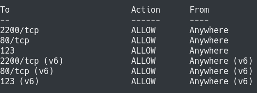
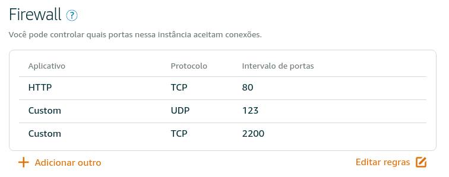

# Configurando Servidor Linux (Amazon Lightsail)
As instruções a seguir apresetam as configurações de um servidor Linux (Ubuntu) para uma aplicação simples construída em Flask.
A aplicação se chama [Catálogo](https://github.com/marshalmori/FlaskApp) e o servidor utilizado é o Amazon Lightsail.


## Especificações do servidor
  * IP público: 18.191.101.227
  * Porta SSH: 2200
  * URLs: http://18.191.101.227/  ----  http://www.solariasoft.com.br/


## Sequência das configurações
### Passo 1 - Criar uma instância na Amazon Lightsail
  1. Crie uma conta no [Amazon Lightsail](https://aws.amazon.com/pt/lightsail/)
  2. Clique no botão `Criar Instância`
  3. Com o campo Linux/UNIX selecionado escolha a opção `Somente SO`
  4. Selecione `Ubuntu 16.04 LTS`
  5. Insira o arquivo com a chave SSH pública
  6. Escolha seu plano de Instância
  7. Finalize clicando no botão `Criar`

### Passo 2 - Acessar a instância criada
Para acessar a instância criada digite a linha abaixo no seu terminal.

`$ ssh ubuntu@<IP público> -i ~/.ssh/<nome-do-arquivo-com-sua-chave-privada>`

### Passo 3 - Fazendo Update e Upgrade
Depois de acessar o servido com o passo anterior agora vamos atualizá-lo com os seguintes comandos:

`$ sudo apt-get update`

`$ sudo apt-get upgrade`

### Passo 4 - Criando o usuário `grader`
Para criar o usuário `grader` basta executar o seguinte comando:

`$ sudo adduser grader`

Ele vai pedir para inserir uma senha e confirmar e na sequência solicitará o preenchimento de alguns dados que não são obrigatórios podendo continuar apertando o `ENTER`.


### Passo 5 - Transformando `grader` em super usuário
Para fazer isso basta criar um arquivo com o nome grader no seguinte caminho:

`$ sudo nano /etc/sudoers.d/grader`

Cole o conteúdo abaixo nesse arquivo.

`grader ALL=(ALL:ALL) ALL`

### Passo 6 - Mude para o usuário `grader`
Digite a linha abaixo para alterar o usuário de ubuntu para grader e insira a senha que configurou no Passo 4.

`$ su - grader`


### Passo 7 - Inserindo a chave pública
Inserindo a chave pública para acessar como grader. Siga a sequência abaixo para obter isso:

`$ mkdir .ssh`

`$ nano .ssh/authorized_keys`

cole a chave pública no arquivo authorized_keys e salve.

### Passo 8 - Configurando as permissões
A configuração das permissões são dadas pelos comandos a seguir:

`chmod 700 .ssh/`

`chmod 600 .ssh/authorized_keys`

`exit` para sair do usuário grader

`exit` para sair do servidor

### Passo 9 - Acessando como `grader`
`$ ssh grader@<IP público> -i ~/.ssh/<nome-do-arquivo-com-a-chave-privada>`

### Passo 10 - Desativando a senha de login
Para isso, edite o seguinte arquivo no servidor:

`$ sudo nano /etc/ssh/sshd_config`

O campo `PasswordAuthentication` deve ser `no` como mostrado abaixo:

`PasswordAuthentication no`

e o mesmo deve acontecer no campo `PermitRootLogin`, ficando assim:

`PermitRootLogin no`

### Passo 11 - Mudar a porta SSH de 22 para 2200
Mudar a porta SSH de 22 para 2200 é feito editando o arquivo:

`$ sudo nano /etc/ssh/sshd_config`

No campo `Port 22` substitua para `Port 2200`

Em seguida restart o serviço:

`$ sudo service ssh restart`

### Passo 12 - Configurando o firewall
Para esse passo utilizaremos o `ufw`, então verifique se está instalado rodando `sudo ufw status`.
E siga os passos abaixo:

  1. `sudo ufw default deny incoming`
  2. `sudo ufw default allow outgoing`
  3. `sudo ufw allow ssh`
  4. `sudo ufw allow 2200/tcp`
  5. `sudo ufw allow www`
  6. `sudo ufw allow 123/udp`
  7. `sudo ufw deny 22`
  8. `sudo ufw enable`

Para verificar como está a configuração execute `sudo ufw status` e a saída deve ser como mostrado abaixo:


### Passo 13 - Configurando o firewall na instância
Acesse sua instância no ambiente da Amazon Lightsail e clique em `Rede` no menu superior. Clique em `Editar regras` e deixe a configuração conforme a imagem abaixo:



No terminal, saia do servidor e acesse novamente passando a porta `2200` do SSH de conforme a linha abaixo:

`$ ssh grader@<IP público> -i ~/.ssh/<nome-do-arquivo-com-a-chave-privada> -p 2200`

### Passo 14 - Instalando o Apache

`$ sudo apt-get install apache2`

### Passo 15 - Instalando o mod_wsgi para o Python 3
`$ sudo apt-get install libapache2-mod-wsgi-py3 python3-dev`

### Passo 16 - Instalando e configurando o PostgreSQL
 1. Para instalar execute `$ sudo apt-get install postgresql postgresql-contrib`
 2. O Postgresql por padrão cria um usuário `postgres` durante a instalação. Então, execute `sudo su - postgres`
 3. Estando no usuário `postgres` execute o comando `psl`
 4. Crie um usuário chamado `catalog` executando `CREATE ROLE catalog WITH LOGIN;`
 5. Autorizando `catalog` a criar banco de dados: `ALTER ROLE catalog CREATEDB;`
 6. Crie uma senha para o usuário `catalog` executando `\password catalog`
 7. Verifique se está tudo certo com `\du` e obtenha a seguinte saída:

 ```
					   List of roles
	 Role name |                         Attributes                         | Member of
	-----------+------------------------------------------------------------+-----------
	 catalog   | Create DB                                                  | {}
	 postgres  | Superuser, Create role, Create DB, Replication, Bypass RLS | {}
  ```


  7. Saia do psql executando `\q`.
  8. Finalize com `exit` para voltar ao usuário `ubuntu`.
  9. Crie um usuário Linux chamado `catalog` com `sudo adduser catalog`, digite a senha e confirme.
  10. Dê permissão de `sudo` a `catalog` criando o arquivo `$ sudo nano. /etc/sudoers.d/catalog` e cole `catalog ALL=(ALL:ALL) ALL` salva e feche.
  11. Execute `sudo su - catalog` para logar como `catalog`.
  12. Logado como `catalog`, crie o banco de dados `catalog` com o comando `createdb catalog`.
  13. Execute `psql` e depois `\l` para verificar se o banco foi criado.
  14. Volte ao usuário `ubuntu` com `exit`.


## Licença
O projeto Configurando Servidor Linux foi lançado com a licença [MIT
license](https://github.com/atom-community/markdown-preview-plus/blob/master/LICENSE.md).
